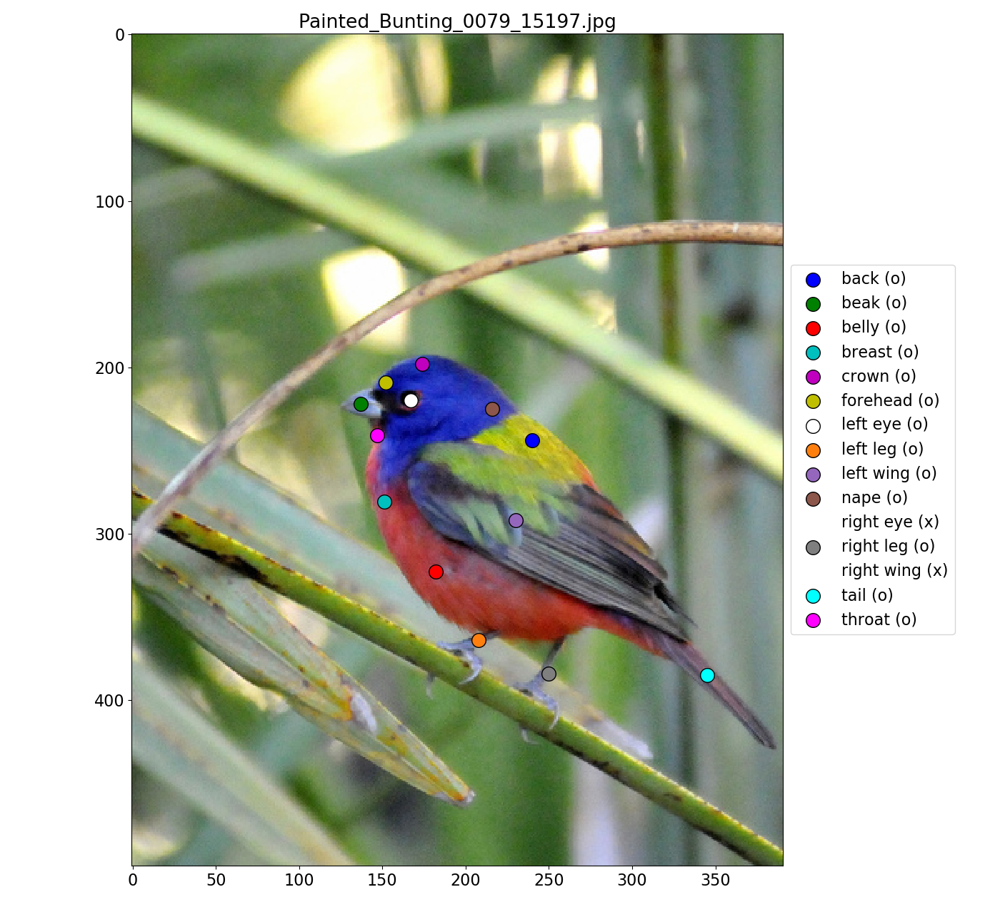
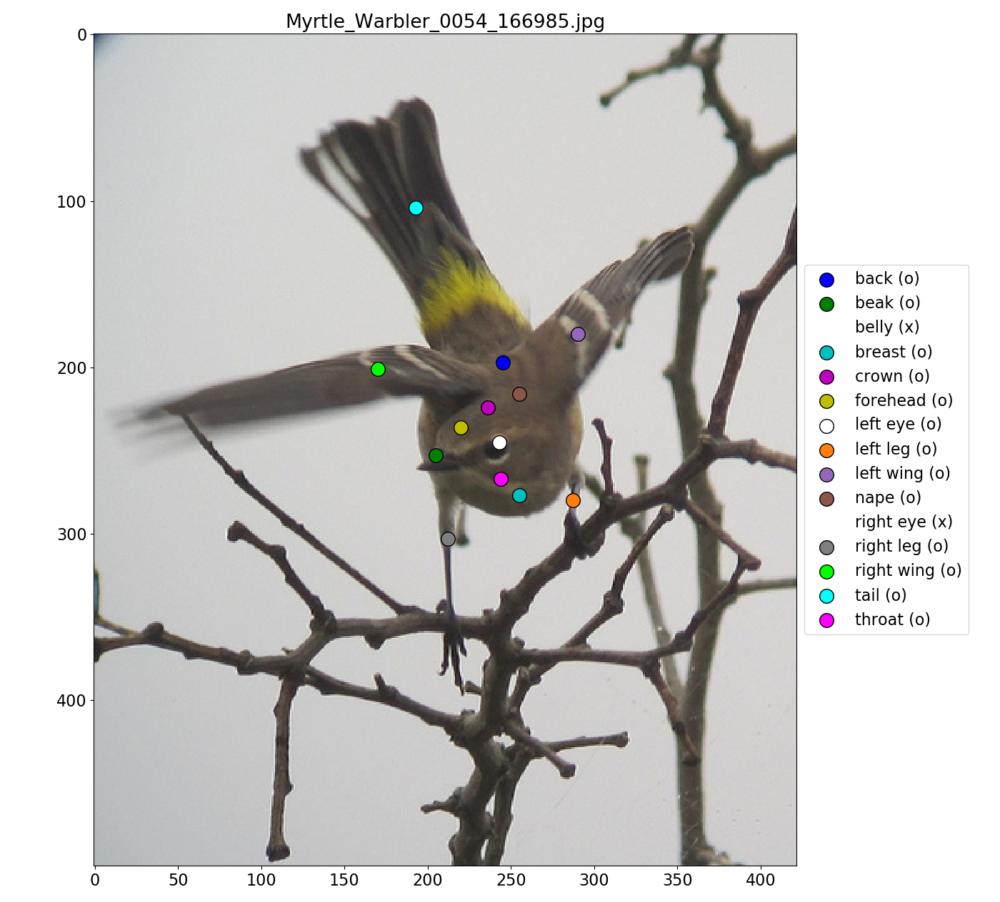
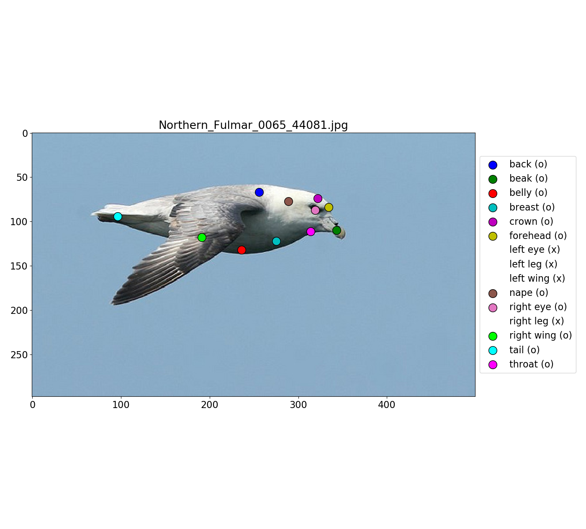

# CUB-200-2011 part visualizer

Visualization tool for CUB-200-2011 part keypoints (Wah et al.).

</center>
</center>
</center>

## Requirements
* [Python](https://www.python.org/) >= 3.x
* [PyTorch](https://pytorch.org/) >= 1.0
* [matplotlib](https://matplotlib.org/)
* [PIL](https://pillow.readthedocs.io/en/stable/)

## Quick startup
plot one bird: 
```
  viz.py --img_path $YOUR_PATH_FOR_CUB_ORIGIN_FOLDER/images/012.Yellow_headed_Blackbird/Yellow_Headed_Blackbird_0059_8079.jpg
```
plot all birds: 
```
  viz.py --plot_order {randomly, in_order}
```

## References
Wah, Catherine, et al. "The caltech-ucsd birds-200-2011 dataset." (2011).
